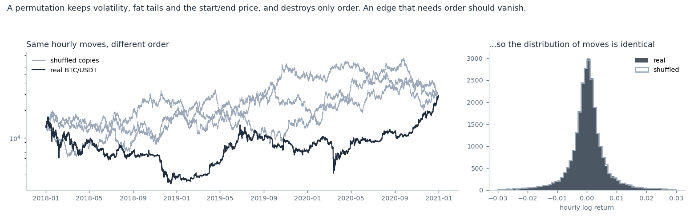
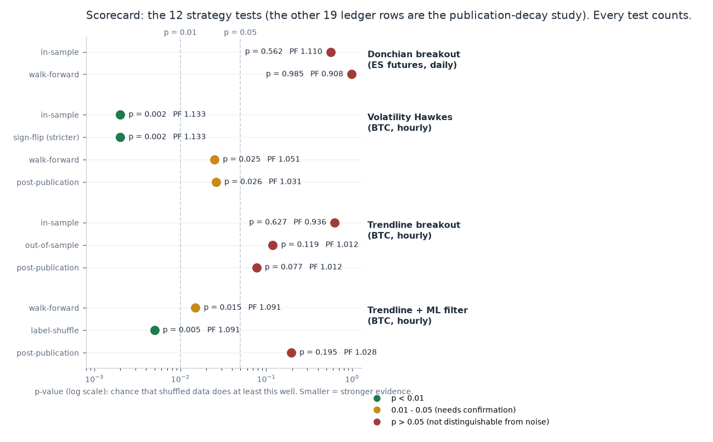
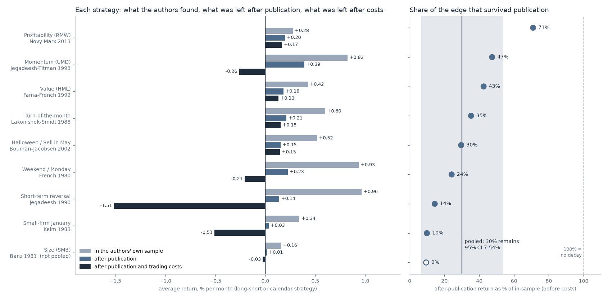
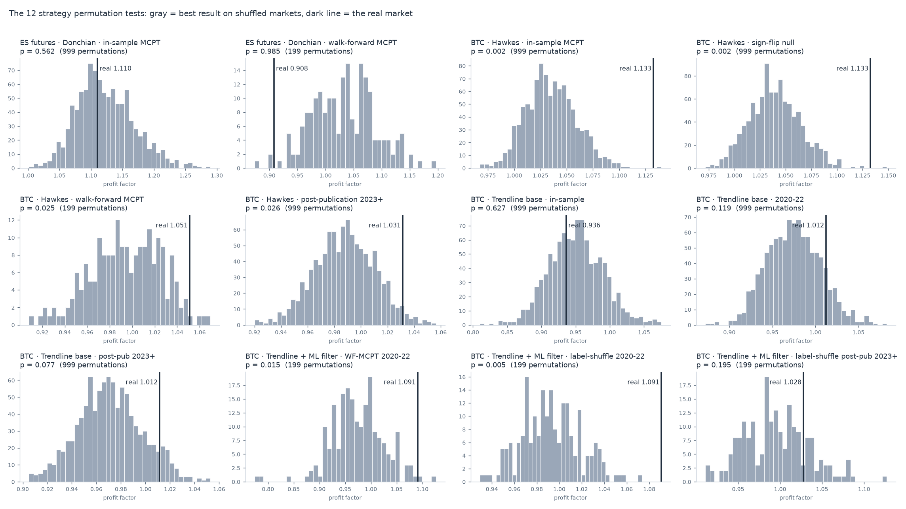
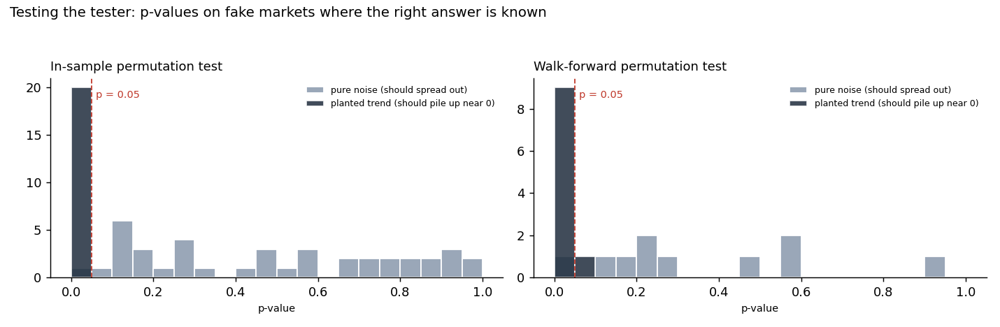

# mcpt-lab

**Test a trading strategy against shuffled markets before you trust it.**

*A backtesting platform designed and built by [David DeConti](https://dnd8639-byte.github.io).*

Almost any strategy looks profitable once its parameters are tuned on past prices, including on prices that are pure noise. `mcpt-lab` asks the question that matters instead: **does this strategy do better on the real market than the same tuning process does on markets where any real pattern has been destroyed?**

It uses **Monte Carlo permutation tests (MCPT)**: shuffle the order of real price moves hundreds of times, re-run the entire strategy on each shuffled copy, and see where the real result lands. This follows the four-step process of [neurotrader888/mcpt](https://github.com/neurotrader888/mcpt), with realistic trading costs, extra null tests, a test suite, and a **ledger that records every test you run**.



---

## What it gives back

Every test returns a p-value: the chance that shuffled data does at least as well as the real data. Here are the first 12 tests run with the platform. Three published strategies were tested on S&P 500 futures and Bitcoin, including on data from **after** each strategy was published:



| strategy | verdict |
|---|---|
| **Donchian breakout** (ES futures) | Looked profitable after tuning (profit factor 1.11). But shuffled markets produced the same result (p = 0.56), and it lost money out-of-sample. **The backtest was an artifact of tuning.** |
| **Volatility Hawkes** (BTC hourly) | Passed all four steps and a stricter sign-flip test. Still positive **after publication** (p = 0.026), but the edge is weaker each phase and disappears at about 20 bps of trading costs. **Real, small, fading.** |
| **Trendline breakout** (BTC hourly) | Base strategy: no edge in any period. |
| **Trendline + machine-learning filter** | The filter really worked in 2020–22: it beat 99.5% of filters trained on scrambled labels. **After publication it stopped working** (p = 0.195). |

Across these 12 tests, only one strategy survived data that did not exist when it was designed. That result is what the platform is for.

A follow-up study took **10 famous published strategies**: value, momentum, the Monday effect, "Sell in May" and others. Pooled, their returns after publication were about **30% of what their authors found**; every one declined (p ≈ 3×10⁻⁹). After realistic trading costs, none keeps a reliable profit. See [docs/RESULTS.md](docs/RESULTS.md#4-ten-famous-published-strategies-how-much-edge-survives-publication).





More detail is in [docs/RESULTS.md](docs/RESULTS.md), and there's a one-page overview in [docs/PROJECT_SUMMARY.md](docs/PROJECT_SUMMARY.md).

---

## The method: a four-step funnel (stop at the first failure)

| step | question | function |
|---|---|---|
| 1. In-sample excellence | Is the best tuned version any good **after costs**? | `in_sample_excellence` |
| 2. In-sample permutation test | Does tuning find more in real data than in 1,000 shuffled copies? | `in_sample_mcpt` |
| 3. Walk-forward | Re-tune on a rolling window and trade the next block. Does it work on data it never saw? | `walk_forward` |
| 4. Walk-forward permutation test | Is that out-of-sample result better than the same walk-forward on shuffled data? | `walk_forward_mcpt` |

There are also tests for the harder questions:

- **Sign-flip null** (`null="signflip"`): keeps every bar's *size* in place and randomizes only its *direction*. It checks whether a volatility strategy really predicts direction or just benefits from volatility clustering.
- **Fixed-parameter test** (`fixed_param_mcpt`): freezes a published strategy's parameters and tests it only on data from after publication.
- **Custom nulls** (`permutation_test`): bring your own statistic and your own randomization. The trendline example uses this to shuffle a machine-learning model's training labels.

The reasoning behind each step is in [docs/METHOD.md](docs/METHOD.md).

---

## Install

The only requirement is Python 3.9 or newer.

```bash
git clone https://github.com/dnd8639-byte/mcpt-lab.git
cd mcpt-lab
python3 -m venv .venv && source .venv/bin/activate      # Windows: .venv\Scripts\activate
pip install -r requirements.txt
```

## Quickstart (about 1 minute, no downloads)

```bash
python examples/01_quickstart.py
```

```
market     best lookback   tuned profit factor   permutation p
noise #1         30          0.985               0.970
noise #2        180          1.120               0.190
noise #3        160          1.180               0.050
noise #4         70          1.109               0.210
noise #5         70          1.125               0.180
trend #1         20          1.453               0.010  <- p < 0.05
trend #2         10          1.417               0.010  <- p < 0.05
...
```

Tuning finds a "profitable" setting in 4 of the 5 pure-noise markets. The permutation test flags only the markets that really have a pattern. (With 100 permutations, the smallest possible p is 0.01.)

## Use it on your own idea

```python
import pandas as pd
from mcptlab import Strategy, in_sample_mcpt, load_ohlc

class MyIdea(Strategy):
    name = "my_idea"
    grid = [10, 20, 40, 80]                 # parameter values to try; keep it small

    def positions(self, data, lookback):
        close = data["close"]
        # +1 long, -1 short, 0 flat for each bar, using ONLY data up to that bar
        return (close > close.rolling(lookback).mean()).astype(float)

if __name__ == "__main__":                   # required for multiprocessing on macOS and Windows
    data = load_ohlc("my_prices.csv")        # any CSV with a date column and a close column
    train = data.loc[:"2019-12-31"]          # keep later data untouched until step 2 passes
    res = in_sample_mcpt(MyIdea(), train, n_perm=1000, cost_bps=5, market="my_market")
    print(res["best_param"], res["real"], res["p"])
```

Each call:

- appends a row to `LEDGER.csv`;
- saves a histogram and the null distribution to `mcpt_runs/`.

`plot_runs()` draws all of your tests in one figure. A copy-and-edit template is in [examples/05_your_own_strategy.py](examples/05_your_own_strategy.py).

## Examples

| script | what it does | time |
|---|---|---|
| `examples/01_quickstart.py` | noise vs. planted trend, steps 1–2 | ~1 min |
| `examples/02_hawkes_four_steps.py [--quick]` | all four steps on a published BTC strategy (data included) | 15 min quick / 1–2 h full |
| `examples/03_hawkes_robustness.py [--quick]` | sign-flip null plus the post-publication test | 10 min quick |
| `examples/04_trendline_metalabel.py [A\|B] [--quick]` | breakout plus random-forest filter, label-shuffle null | hours (full) |
| `examples/05_your_own_strategy.py [prices.csv]` | template for your own idea | minutes |
| `examples/06_publication_decay.py` | 10 famous published strategies: how much edge survives publication? (run `python data/download_french.py` first) | ~1 min |
| `examples/07_decay_after_costs.py` | the same strategies after trading costs and slippage | ~1 min |
| `validation/validate.py` | tests the tester on fake markets with known answers | ~10 min |
| `scripts/make_figures.py` | rebuilds every figure in `results/figures/` | ~1 min |

`--quick` uses fewer permutations, so its p-values are coarser. The smallest possible p is 1 ÷ the number of permutations, and quick results can differ from the full runs recorded in `results/`. The post-publication tests need recent data. Download it with `pip install ccxt && python data/download_binanceus.py`.

## Is the tester itself trustworthy?

Before any strategy was tested, the permutation test was run on fake markets where the right answer is known (`validation/validate.py`):

- **Pure noise** (fat tails, volatility clustering, no exploitable pattern): p-values spread evenly between 0 and 1. Only 1 of 40 fell below 0.05 in-sample, with a mean p of 0.49. Nothing should be found here, and nothing was.
- **Planted trends**: the in-sample test found 20 of 20. The walk-forward test found 9 of 10.

`python -m unittest discover tests` runs 15 checks in about 20 seconds, including:

- next-bar execution;
- cost accounting;
- reproducible permutations;
- a look-ahead "canary" that shows what a strategy peeking at future prices looks like.



## House rules

These are what make a p-value mean something:

1. **Costs always on.** An edge that only exists at zero cost is not an edge.
2. **Small parameter grids.** Every extra value gives the tuner another chance to fit noise.
3. **The ledger is your conscience.** If you've tried 20 ideas, one will reach p < 0.05 by luck. Judge each p-value against the ledger count.
4. **Don't look at out-of-sample results until step 2 passes.** Looking and then changing the idea turns test data into training data.
5. **One change = one new test.** Changing a rule after seeing a result is a new idea, and it goes in the ledger.

## Repository layout

```
mcptlab/        the library: permutations, four-step tests, strategies, plots
examples/       runnable walkthroughs (01-07)
data/           bundled BTC sample (2018-2022) + downloaders (Binance.US, Ken French library)
tests/          unit tests (python -m unittest discover tests)
validation/     calibration on synthetic markets
results/        LEDGER.csv, saved null distributions, figures
docs/           METHOD.md, RESULTS.md, LEARN.md, PROJECT_SUMMARY.md
scripts/        make_figures.py
```

## Credits and license

- The permutation method, the four-step process and the two BTC strategies come from **neurotrader888**'s MIT-licensed repositories:
  - [mcpt](https://github.com/neurotrader888/mcpt)
  - [VolatilityHawkes](https://github.com/neurotrader888/VolatilityHawkes)
  - [TrendlineBreakoutMetaLabel](https://github.com/neurotrader888/TrendlineBreakoutMetaLabel)
- Adapted code keeps its attribution; see [NOTICE.md](NOTICE.md).
- Everything else is MIT licensed; see [LICENSE](LICENSE).

**This is a research and education tool, not investment advice.** Nothing here is a recommendation to trade. Its main lesson is how rarely a backtest survives an honest test.
