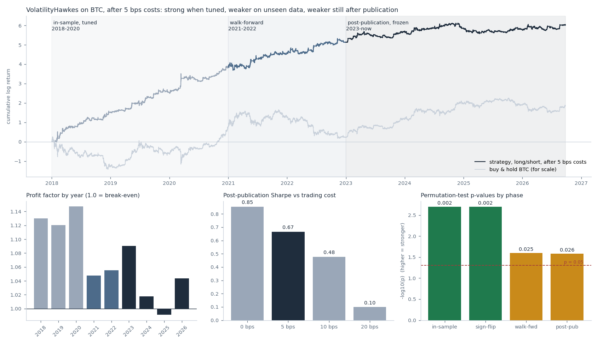
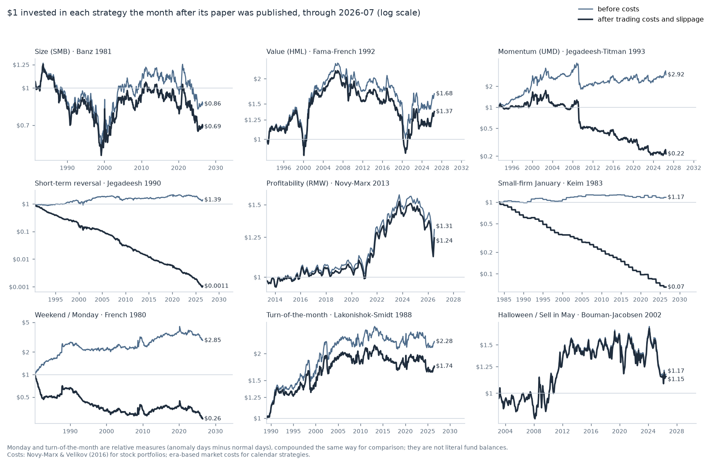
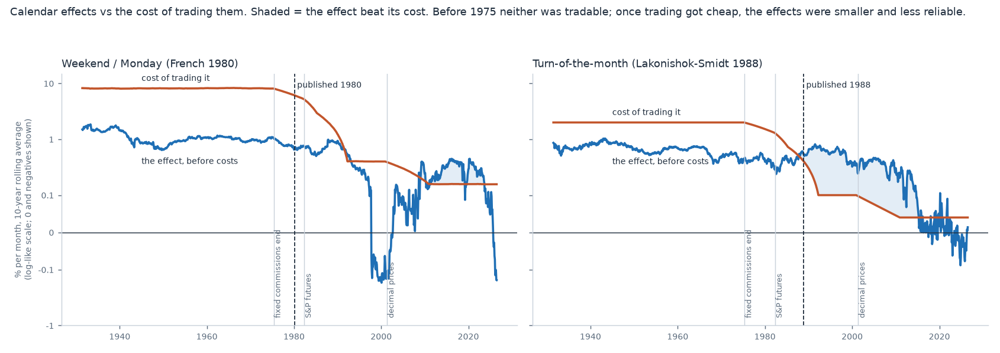

# Results

Every test below was run with this platform, and every test run is shown, including the ones that failed. The raw record is in [`results/LEDGER.csv`](../results/LEDGER.csv), and the null distributions are in [`results/nulls/`](../results/nulls/).

All BTC tests use:
- 5 bps cost per unit traded;
- the author's own parameter grids;
- a test design written down before the test was run.

## 1. Donchian breakout on S&P 500 futures: a backtest that is pure tuning

This is neurotrader's teaching example, run on 16 years of clean E-mini S&P 500 futures data.

| step | result |
|---|---|
| 1. tuned 2010–2018 | best lookback 125 days, profit factor **1.11**, Sharpe 0.54: looks fine |
| 2. in-sample permutation test | **p = 0.562**; the median shuffled market also reached PF 1.117 |
| 3. walk-forward 2014–2026 | profit factor **0.91**, Sharpe −0.50: loses money |
| 4. walk-forward permutation test | p = 0.985 |

A respectable-looking backtest is exactly what tuning produces from noise. Step 2 caught this before step 3 confirmed it.

## 2. Volatility Hawkes on Bitcoin: real, small, and fading

**Strategy.** A Hawkes process measures how "excited" volatility is.
- When volatility jumps from quiet to excited, trade in the direction price has moved.
- Exit when volatility calms down.

| test | profit factor | Sharpe | p |
|---|---|---|---|
| in-sample 2018–2020, 25 settings tuned | 1.133 | 2.26 | **0.002** |
| sign-flip null (volatility kept, direction random) | 1.133 | | **0.002** |
| walk-forward 2021–2022 | 1.051 | 1.06 | **0.025** |
| **post-publication 2023 → Sept 2026, parameters frozen** | **1.031** | **0.67** | **0.026** |

- **It passes every step, including on data that didn't exist when it was published.** The sign-flip test shows it times *direction*, not just volatility.
- **The edge shrinks at each phase.** Profit factor goes from 1.13 to 1.05 to 1.03, and 2025 was a losing year.
- **It is cost-sensitive.** The post-publication Sharpe falls from 0.85 at zero cost to 0.10 at 20 bps.
- **All the post-publication profit came from long trades.** Longs had a profit factor of 1.083; shorts had 0.995.

**Verdict:** the one real edge found, and too small to trade confidently.

## 3. Trendline breakout plus a machine-learning filter: an edge that died after publication

**Base strategy.** Buy when price breaks above a fitted resistance line.

**Filter.** A random forest looks at five features of each breakout and predicts whether it will win. It is re-trained every year.

| test | profit factor | p |
|---|---|---|
| base, 2018–2019 | 0.936 | 0.627 |
| base, 2020–2022 | 1.012 | 0.119 |
| base, 2023 → now | 1.012 | 0.077 |
| **filter, 2020–2022, full pipeline permuted** | **1.091** | **0.015** |
| **filter, 2020–2022, vs filters trained on scrambled labels** | **1.091** | **0.005** |
| **filter, 2023 → now, vs scrambled-label filters** | **1.028** | **0.195** |

- **The base breakout never had an edge.**
- **The filter genuinely worked in 2020–2022.** It beat 99.5% of filters that learned from scrambled labels.
- **After publication, its improvement over taking every trade shrank by about 80%.** It can no longer be told apart from a filter that learned nothing.

## 4. Ten famous published strategies: how much edge survives publication?

Preregistered as `PREREGISTRATION_v6.md`; full write-up in `RESULTS_v6.md`. The script is `examples/06_publication_decay.py` (data: Kenneth French Data Library, 1926 → 2026-07).

**Design** (after McLean & Pontiff, 2016):
- Each strategy uses its published rule, with no tuning.
- Its monthly returns are scored in three windows: the authors' own sample, the gap before publication, and after publication.
- The windows are pooled in one regression, with standard errors clustered by month.

| strategy | paper | after-publication return as % of in-sample |
|---|---|---|
| Value | Fama-French 1992 | 43% |
| Momentum | Jegadeesh-Titman 1993 | 47% |
| Short-term reversal | Jegadeesh 1990 | 14% |
| Profitability | Novy-Marx 2013 | 71% |
| Small-firm January | Keim 1983 | 10% |
| Weekend / Monday | French 1980 | 24% |
| Turn-of-the-month | Lakonishok-Smidt 1988 | 35% |
| Halloween | Bouman-Jacobsen 2002 | 30% |
| Size | Banz 1981 | 9% (excluded from the pooled test: did not replicate in-sample on our data) |

- **Pooled:** after publication, returns average **30% of their in-sample level** (one-sided p ≈ 3×10⁻⁹). Every strategy declined.
- **What's left:** no strategy's post-publication return survives a correction for the 9 tests run.
- **Faber's 10-month moving-average timing** kept its claimed benefit, lower drawdowns (−18% vs −50% after publication), mostly thanks to 2008.
- **Caveats:**
  - "After publication" is also "later in time".
  - Famous strategies were chosen, which may overstate decay.

**After trading costs and slippage** (`examples/07_decay_after_costs.py`, `PREREGISTRATION_v7.md`):
- **Costs:** measured effective spreads from Novy-Marx & Velikov (2016) for the stock portfolios; era-dependent costs of trading the whole market for the calendar strategies (about 1% one-way before 1975, 2 bps today).
- **No strategy keeps a statistically reliable profit after publication.** The best is turn-of-the-month, +0.15%/mo, p = 0.087.
- **Five of nine lose money net.** Short-term reversal loses money even in its authors' own sample.
- **The Monday and turn-of-the-month effects were never tradable when they were discovered:** net −6.8% and −1.1% per month in-sample. By the time trading became cheap, they had shrunk.

All 18 permutation tests from this study are in [decay_tests.png](../results/figures/decay_tests.png).

## What the platform showed

1. **Tuning makes backtests look good.** The ES example is the standard case.
2. **Permutation tests can find real structure** (Hawkes in-sample, the trendline filter in 2020–22). They can also refuse to find it where there is none (Donchian, the base trendline).
3. **Publication decay is measurable.** One strategy weakened but survived. The other's edge disappeared. Across 8 classic published strategies, about 70% of the in-sample return was gone after publication.
4. **No test was hidden.** The ledger has 22 rows. Judged against 22 tries, only results with p well below 0.05, or results confirmed on new data, deserve attention.

## Porting checks

Before testing, each strategy was checked against its author's original code:

| strategy | check |
|---|---|
| Volatility Hawkes | Reproduces the author's result exactly: PF 1.0687, time in market 50.7%. |
| Trendline | Resistance line uses an exact closed-form solution instead of the author's iterative search (about 150× faster). 1,172 of 1,175 trades are identical; the other 3 are borderline cases where the iterative search stops early. The author's walk-forward results reproduce closely: 1.0535 / 1.137 vs 1.0539 / 1.142. |
| Permutation function | Vectorized; output is identical to the original (maximum difference 0.0). |
